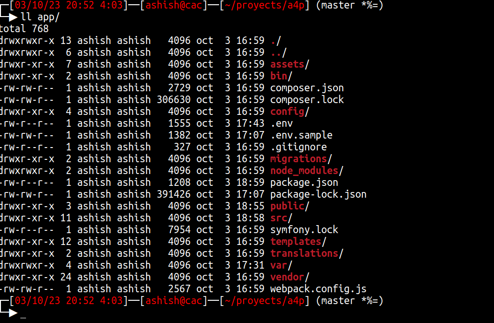

# This is my customized bash look
If you like this bash features and how it looks you can download it and install them easily just executing the install.sh file. \
Be careful to clone the right branch.



## Bash prompt explanation

┌─[d/m/y h:i (time since bash loggin)]──[user@system_name]──[~/path/to/your/folder] (branch (git status)) \
└─▶ command

### Git status explanation:
#### '<' means behind '>' means ahead, '<>' means diverged, '=' means no difference (comparing local branch)
#### '+' means staged
#### '*' means unstaged
#### '$' means something is stashed
#### '%' means untracked files


## Install
Step-by-step guide to install in a system like ubuntu (maybe other distros you'll have to tinker it a bit)

1. Clone the branch bash_adn_atom
```
git clone -b bash_and_atom https://github.com/Crater44/cougar_pde.git
```
2. Move into folder
```
cd cougar_pde
```
3. Run the installation file
```
bash install.sh
```
4. Refresh bash
```
source $HOME/.bashrc
```
5. Clean up (optional)
```
cd ../ ; rm -rf cougar_pde
```
#### Gimme a start if you think that was easy to install.
